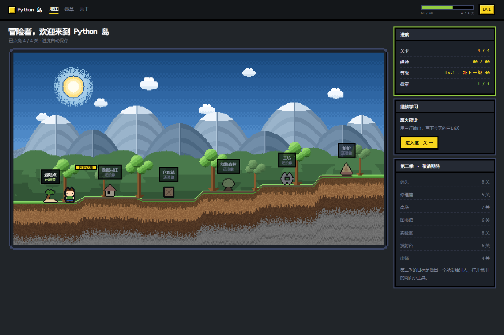
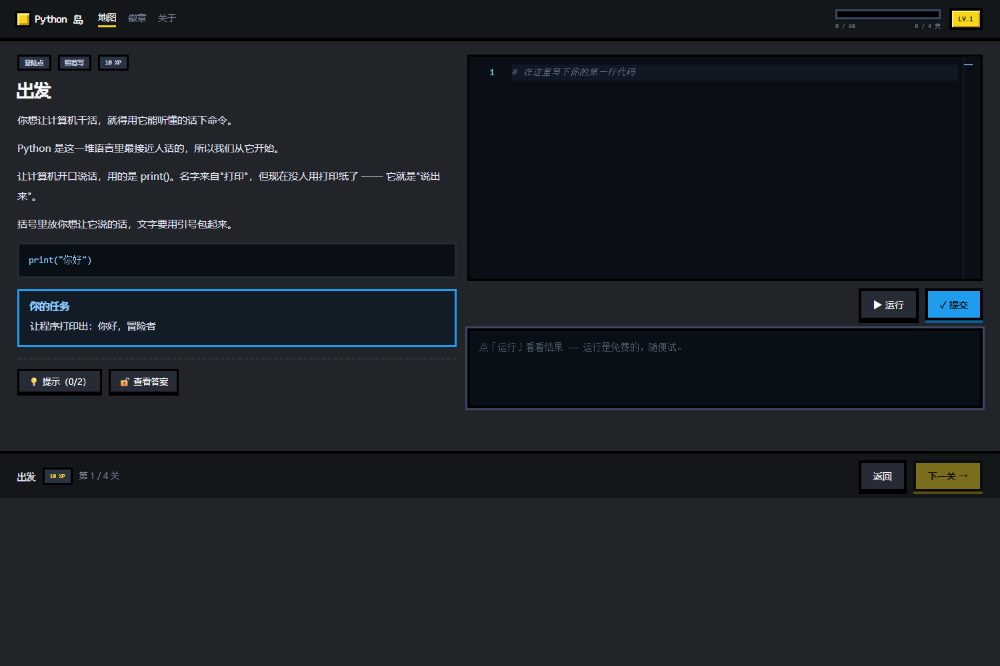
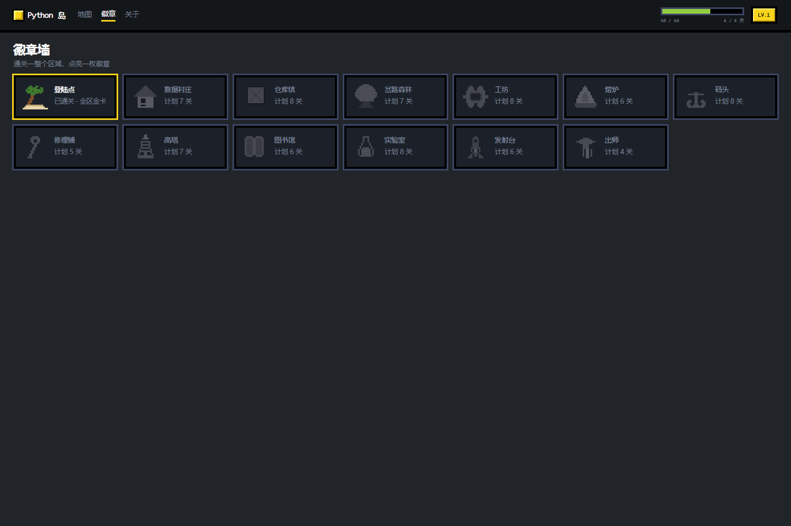

# Python 岛 🏝

**一个游戏化的 Python 入门课程 —— 在浏览器里学，每写一行代码都能立刻跑起来。**

40 关 · 6 个区域 · 从"让计算机说第一句话"一路做到"独立写出一个能玩的小游戏"。

不用装 Python，不用配环境，打开网页就能写。



---

## 这是什么

一个给自己用的 Python 学习网站，做成了游戏的样子：

- **像素风横版地图** —— 6 个区域（登陆点 → 数据村庄 → 仓库镇 → 岔路森林 → 工坊 → 熔炉），做完一关点亮一格
- **真跑 Python** —— 代码在浏览器里用 [Pyodide](https://pyodide.org/) 执行，不是模拟、不是选择题
- **即时判分** —— 写完点提交，当场告诉你哪条测试没过、期望什么、你给了什么
- **分层提示 + 参考解** —— 卡住了可以看提示（卡片降级为银卡），实在不行看答案（灰卡）
- **XP / 等级 / 徽章** —— 每关 10 XP，BOSS 关 30 XP，做完一个区点亮一枚徽章
- **进度自动保存** —— 存在浏览器本地，关掉再打开接着做



## 快速开始

需要 **Node.js 20+**。

```bash
git clone https://github.com/TT-272/python-island-course.git
cd python-island-course/python-island
npm install          # 会自动把 Pyodide 运行时复制到 public/pyodide
npm run dev
```

打开 <http://127.0.0.1:5173/> 就能开始学。

> Windows 用户也可以直接双击 `python-island/start-python-island.ps1`，它会自动拉起服务并打开浏览器。

## 课程结构

40 关分成 6 个区域，每个区一个主题、末尾一个 BOSS 关。

| 区域 | 关数 | 学什么 | BOSS |
|---|---|---|---|
| 🏖 **登陆点** | 4 | `print()`、字符串、**读懂报错** | 篝火夜话 |
| 🏘 **数据村庄** | 7 | 变量、`int`/`float`/`str`、`bool`、类型转换、`input()` | 体温计 |
| 📦 **仓库镇** | 8 | 列表、字典、元组、集合、切片 | 歌单管理器 |
| 🌲 **岔路森林** | 7 | `if` / `elif` / `else`、比较运算、`and`/`or`/`not` | 垃圾分类员 |
| ⚙️ **工坊** | 8 | `for`、`while`、`break`/`continue`、嵌套循环、`random` | 猜数字前传 |
| 🔧 **熔炉** | 6 | `def`、参数、`return`、`lambda` | **结业：猜数字游戏** |

**520 XP · 5 个等级 · 6 枚徽章**



### 学完能到什么程度

能独立写出 **几十行、有输入有判断有循环有函数** 的小程序（猜数字、点歌台、垃圾分类、成绩统计）；能读懂报错、定位到第几行、自己修好。

**还不会**（留给第二季）：读写文件、异常处理、类与对象、第三方库、把作品发布到网上。

## 六种题型

相邻两关题型一定不同，避免一直做同一种题。

| 题型 | 做什么 |
|---|---|
| 照着写 | 讲解里给范式，照着敲 |
| 补全填空 | 起手代码留一个洞，填上就通 |
| 预测输出 | 先自己猜结果，再写代码验证 |
| **找 bug** | 给一段坏代码，修好它（题目区会红框圈出问题所在） |
| 从零写 | 只给需求，自己搭 |
| 自由创作 | 综合题，只给目标 |

> 「找 bug」是这个项目自己加的题型 —— 真实工作里大半时间在找 bug，新手最该练的是"看懂报错"。

## 怎么加一关

课程内容是**数据驱动**的，加一关不用改任何组件代码。

1. 在 `python-island/src/content/lessons/` 新建 `py-41.ts`：

```ts
import type { Lesson } from '../types';

export const py41: Lesson = {
  id: 'py-41',
  region: 'dock',          // 属于哪个区
  order: 41,
  title: '读文件',
  type: 'guided',          // guided | fill | predict | debug | scratch | free
  xp: 10,
  summary: '把文件里的内容读进来',
  content: [
    { t: 'p', text: '先说为什么需要它……' },
    { t: 'code', lang: 'python', code: 'print("例子")' },
    { t: 'tip', text: '一个提醒。' },
  ],
  exercise: {
    prompt: '题目要求……',
    starterCode: '# 起手代码\n',
    stdin: '可选：喂给 input() 的内容',
    tests: [
      {
        name: '输出正确',
        code: 'assert _stdout.strip() == "期望的输出", f"应该输出 期望的输出，你输出的是 {_stdout.strip()!r}"',
      },
    ],
    hints: ['第一层提示', '第二层提示'],
    solution: 'print("期望的输出")',
  },
};
```

2. 在 `python-island/src/content/index.ts` 里注册（加 import + 加进 `ALL` 数组）
3. 在 `python-island/src/content/regions.ts` 里把 `py-41` 加进对应区域的 `lessons` 数组
4. **跑一遍内容自检**：`npm run dev` 后打开 <http://127.0.0.1:5173/engine>，点「检查全部 N 关」

> 自检会把每一关的**参考答案**跑一遍，对着它自己的判分用例。有一条不绿，就说明那道题坏了 —— 学员做题时会卡住。

### 写判分用例的三个要点

判分用例是一段 Python 代码，在学员的代码跑完之后、**同一个命名空间**里执行。它能读三样东西：

- `_stdout` —— 学员程序的完整输出
- `_code` —— 学员提交的源码（想要求"必须用某种写法"时用）
- 学员定义的所有变量

```python
# 输出类
assert _stdout.strip() == "你好", f"应该输出 你好，你的程序输出的是 {_stdout.strip()!r}"

# 多行输出
lines = [l for l in _stdout.strip().split("\n") if l.strip()]
assert lines == ["第一行", "第二行"], f"应该输出两行，你输出的是 {lines}"

# 检查变量
assert "score" in globals(), "题目要求定义 score 变量"
assert score == 75, f"score 应该是 75，现在是 {score!r}"

# 要求指定写法（文本匹配，不解析语法）
assert ".pop(" in _code, "这一关要用 pop() 拿掉最后一个"
```

**`assert` 的第二个参数就是给学员看的话**，一定要写成"应该是什么、你给了什么"。

## 项目结构

```
python-island-course/
├── python-island/              应用本体
│   ├── src/
│   │   ├── content/            课程内容（数据驱动，加关卡只改这里）
│   │   │   ├── lessons/        40 个关卡文件
│   │   │   ├── regions.ts      6 个区域定义
│   │   │   └── types.ts        数据结构
│   │   ├── runtime/            判题引擎（runner.py 在 Pyodide 里跑）
│   │   ├── pages/              地图 / 区域 / 关卡 / 徽章 / 关于 / 引擎自检台
│   │   ├── gfx/                手绘像素素材
│   │   ├── map/                横版地图渲染器（canvas）
│   │   ├── state/              进度存档（localStorage）
│   │   └── ui/                 编辑器、像素边框等组件
│   ├── public/
│   │   ├── fonts/              像素字体
│   │   └── pyodide/            Pyodide 运行时（postinstall 自动生成，不进版本库）
│   └── scripts/copy-pyodide.mjs
└── docs/                       设计文档与美术规范
```

## 技术栈

| | |
|---|---|
| 前端 | React 19 + TypeScript + Vite |
| 编辑器 | Monaco Editor（自定义像素主题） |
| Python 运行时 | Pyodide（WebAssembly，浏览器里跑真 Python） |
| 判题 | 自定义 runner.py：捕获输出、抓行号、把报错翻译成中文人话 |
| 存档 | localStorage |
| 美术 | 全部手绘像素点阵（16×16），无图片素材 |

**关于 Pyodide 的体积**：运行时（wasm + 标准库）约 13MB，首次打开需要下载一次，之后浏览器会缓存。所以仓库里不存它 —— `npm install` 时由 `postinstall` 从 `node_modules` 复制。

## 设计文档

`docs/` 里有完整的设计过程，想自己做一个类似项目的话可以参考：

- [`课程设计.md`](docs/课程设计.md) —— 40 关完整设计、判分约定、技术约束
- [`Python岛-设计方案.md`](docs/Python岛-设计方案.md) —— 美术规范、像素边框方案、地图设计
- [`第一季-审查报告.md`](docs/第一季-审查报告.md) —— 一次完整的课程审查（发现了什么、怎么修的）
- [`Codédex官方课程对照.md`](docs/Codédex官方课程对照.md) —— 与 Codédex 官方课程的逐条对照
- [`第二季规划-交接.md`](docs/第二季规划-交接.md) —— 第二季 44 关规划

## 授权

- **代码**（`python-island/`）→ [MIT](LICENSE)
- **课程内容**（讲解、题目、美术、文档）→ [CC BY-NC-SA 4.0](LICENSE-CONTENT.md)

简单说：代码随便用，课程内容可以拿去学习或教学，但**不能拿去卖钱**。

## 致谢

- 知识点顺序参考了 [Python-100-Days](https://github.com/jackfrued/Python-100-Days)（骆昊）
- 游戏化学习的产品形态参考了 [Codédex](https://www.codedex.io/)（XP、徽章、像素地图）
- 像素中文标题字体：[Fusion Pixel Font](https://github.com/TakWolf/fusion-pixel-font)（MIT）

**课程内容为原创**，未复制上述项目的文字或代码。